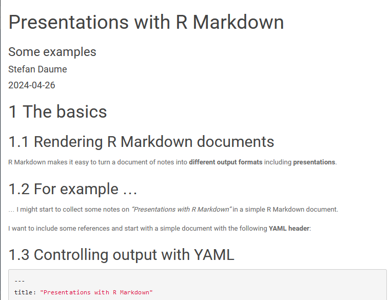

```{r setup, include=FALSE}
knitr::opts_chunk$set(echo = TRUE)
```

# The basics

## Rendering R Markdown documents

R Markdown makes it easy to turn a document of notes into **different output formats** including **presentations**.


## For example ...

... I might start to collect some notes on *"Presentations with R Markdown"* in a simple R Markdown document.

I want to include some references and start with a simple document with the following **YAML header**:


## Controlling output with YAML

``` yaml
---
title: "Presentations with R Markdown"
subtitle: "Some examples"
author: Stefan Daume
date: "`r Sys.Date()`"
output: 
  bookdown::html_document2:
    theme: paper
always_allow_html: true
bibliography: references.bib
link-citations: no
---
```

Using `knitr` (e.g. the "Knit" button in RStudio) renders this document as an HTML page.

## R Markdown as an HTML page

Which would look like that:

```{r screenshot, echo=FALSE}

```


## R Markdown

As with any R Markdown document embedded R code chunks will be evaluated and included in the rendered document. For example:

```{r cars}
summary(cars)
```


## Including Plots

Or a plot:

```{r pressure}
plot(pressure)
```


## R Markdown book

Consult the R Markdown book [@XieAllaire_et_2023_BOOK] for more options.

Including this citation demonstrates how **dynamic references and bibliographies** can be included in any R Markdown output format. Check the "References" section at the end of the document.


# Move to presentation format

## Change the output format

By changing the output format in the YAML header we can turn the initial document into a presentation. 

```
---
title: "Presentations with R Markdown"
subtitle: "Some examples"
author: Stefan Daume
date: "`r Sys.Date()`"
output:
  ioslides_presentation:
    widescreen: true
always_allow_html: true
bibliography: references.bib
link-citations: no
---
```

**ioslides** is only one of several supported HTML presentation formats.


## Structuring the presentation

In most supported HTML presentation formats slides headers of type `#` and `##` are translated in individual slides with the header text as slide title.

Using `---` creates a slide without a title.


## Useful features

Most HTML presentation output formats support useful features like **presenter mode** out of the box. 

Check the R Markdown book [@XieAllaire_et_2023_BOOK] for more features such as incremental display of content, custom CSS, templates etc.


## Online presentations


## References
